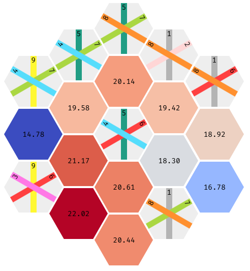
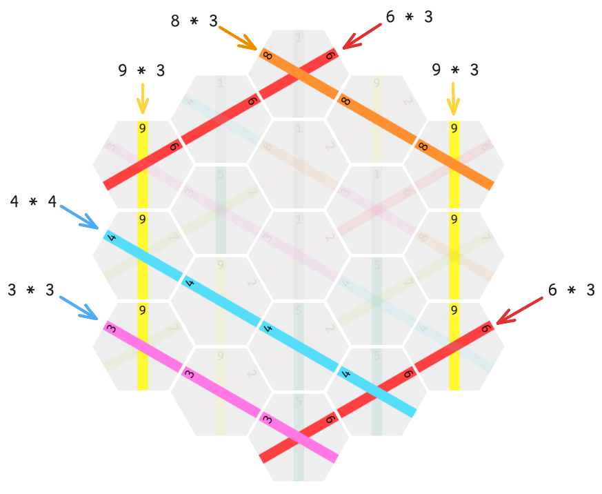

# Take It Easy

 - Simple `python` implementation of Take it Easy with a nice API and support for generating visualisations
 - Optimised `rust` bindings for `python` that implement a faster, optimised version (in the `parallel` branch)

See the [rules](#game), how to [use the library](#usage) and the details about the following [bots](#bots):
 - [Naïve heuristic based on probabilities](#bots)
 - [MCTS based solver](#bots)
 - [Neural Network based solver using DQN](#neural-network)

## Game

[Take It Easy](https://en.wikipedia.org/wiki/Take_It_Easy_(game)) is a single player strategy board game involving a hexagonal board with 19 tiles and 27 pieces.

The player draws a random piece from their stack and places it onto the board, repeat until full.



The final score is then calculated as follows: for every completed line, the player gets `line_length * line_value` points. The goal is to get the highest possible score.



The score for the above example is `121` points.

The perfect score is exactly `307`, there exist 16 such combinations.

Due to the large number of possible combinations of drawn pieces, different drawing orders and placements, the game is not fully solvable.

$$ \binom{27}{19} \cdot 19! \approx 2.7 × 10^{23} \quad \text{possible games} $$

## Usage

Install the required packages using `pip3 install -r requirements.txt`. Then either run the `python3 benchmark.py` or any of the provided bots:
 - `python3 simple.py`
 - `python3 mcts.py`
 - `python3 nn.py`

In case you want to use the implementation of the game, see the following example. The implementation of `Board` is also well documented.

```python
from takeiteasy import Board

board = Board(seed)

while len(board.empty_tiles) > 0:
	piece = board.draw()
	tile = random.choice(board.empty_tiles)
	board.play(piece, tile)

	# Render a HTML page to visualise board
	board.show()

print(board.score())
```

If you want to use the `Maximiser` class as a starting point for your own implementation of a bot, see the following example.

```python
class MyMaximise(Maximiser):
	def heuristic(self):
		# Override this function to use the simple tactic of evaluating all possible board states for the current tile.

		# access self.board or other states
		# return a float that will be used to evaluate the state
		...

	def best_move(self, piece):
		# Override this for custom logic to choose a best move, not relying on the evaluation of all possible next states
		# return the index of the tile on which to place the piece and a dict with expectation values for all tiles (debug / visualisation aid)
		...
```

## Bots

Due to the computational impossibility of computing all possible games, we have to make due with heuristics.

I implemented multiple solutions:
 1. A neural-network implemented as inspired/copied from [polarbart/TakeItEasyAI](https://github.com/polarbart/TakeItEasyAI)
 2. Monte-Carlo Tree Search
 3. Simple heuristic that uses the amount of pieces that are left and the probability of drawing each piece

To run a benchmark comparing the approaches, I recommend running `python3 benchmark.py`. This should give you a statistical basis for comparisons and aid in developing new heuristics.

## Neural Network

The architecture of the neural network used to play the game was fully copied from the [polarbart/TakeItEasyAI](https://github.com/polarbart/TakeItEasyAI) repository.

I reimplemented his DQN approach as a learning tool under `nn.py`.

The implementation in the `master` branch was written to be easily readable and understandable. Once I had understood [polarbart](https://github.com/polarbart)'s approach, I implemented an optimised `Trainer` using `rust` bindings in the `parallel` branch.