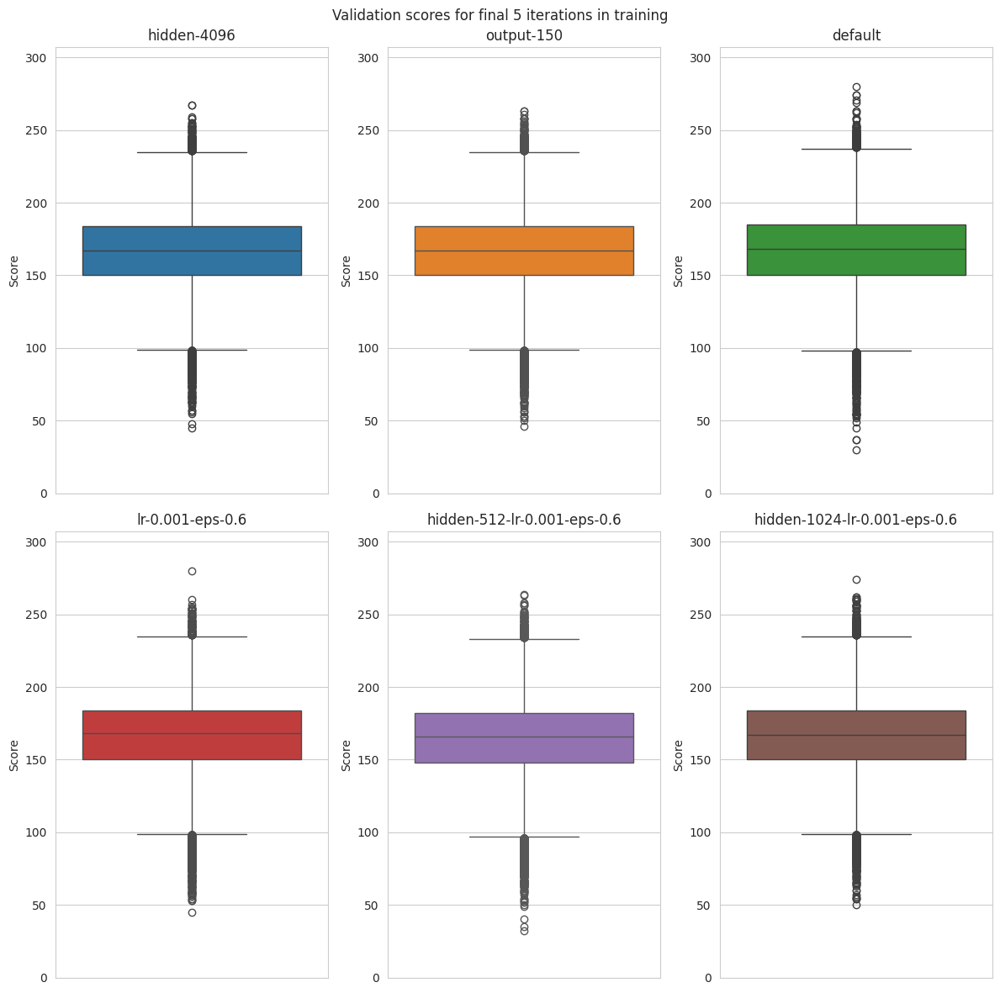
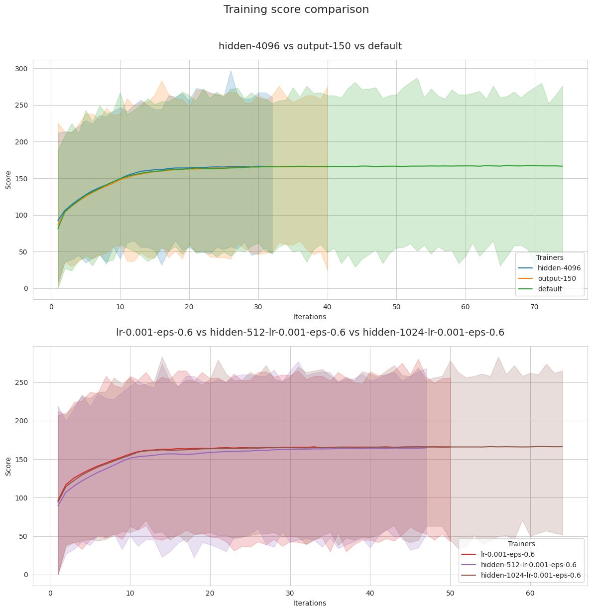
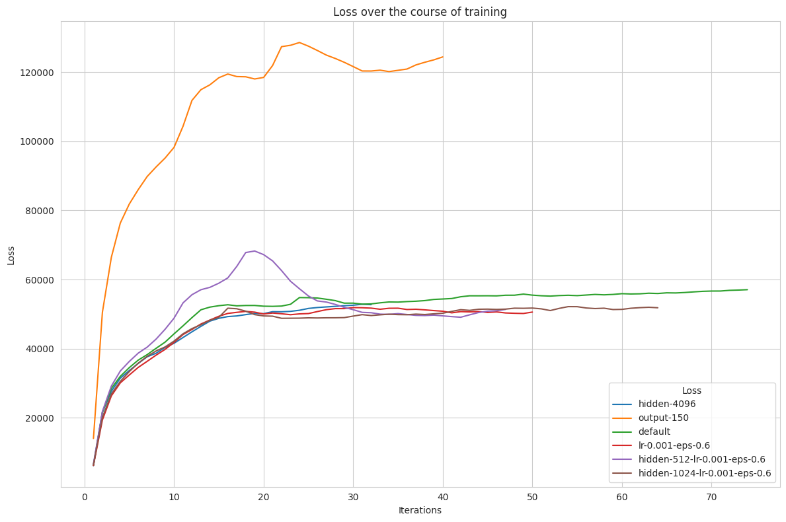
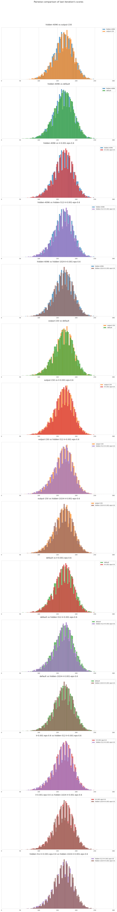

# Training

I have included `training_runs.json` and `full_results.json` if you want to know more about which combinations of hyperparameters I tried.

The first file (`training_runs.json`) contains an overview of all configurations I chose and the best model results I got. The second file (`full_results.json`) contains the results for each iteration, with which you can reconstruct the progress during training.

If you need any more data or have ideas about configurations that could improve upon the existings ones, please contact me @ the mail address listed on my [website](https://obrhubr.org).

## An overview of training results in graphs:

```json
Name: default - mean=168.06, min=mean=55.0, max=mean=255.0
Name: hidden-4096 - mean=166.54, min=mean=48.0, max=mean=267.0
Name: output-150 - mean=166.27, min=mean=65.0, max=mean=258.0
Name: lr-0.001-eps-0.6 - mean=166.09, min=mean=45.0, max=mean=249.0
Name: lr-0.001 - mean=166.85, min=mean=60.0, max=mean=275.0
Name: eps-0.6 - mean=160.81, min=mean=52.0, max=mean=267.0
Name: eps-0.8 - mean=164.08, min=mean=55.0, max=mean=258.0
Name: lr-0.001-eps-0.5 - mean=167.35, min=mean=45.0, max=mean=269.0
Name: hidden-4092-lr-0.001-eps-0.6 - mean=166.54, min=mean=57.0, max=mean=255.0
Name: hidden-512-lr-0.001-eps-0.6 - mean=164.69, min=mean=52.0, max=mean=268.0
Name: hidden-1024-lr-0.001-eps-0.6 - mean=166.48, min=mean=54.0, max=mean=260.0
Name: hidden-1024-lr-0.01-eps-0.6 - mean=160.89, min=mean=37.0, max=mean=267.0
```

You'll notice that all results are pretty close to ~167, regardless of configurations. Read the post on my blog for a more in depth delve into the results.
And some pretty graphs...







